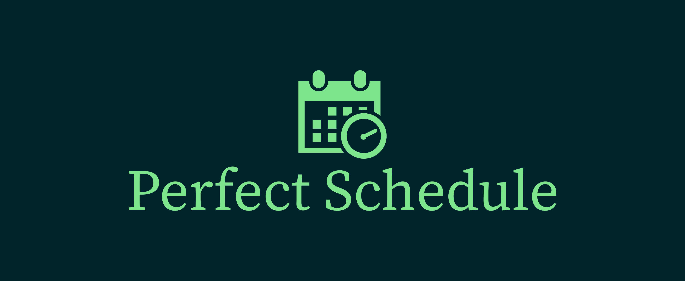

# **Perfect Schedule by Team 714**

Perfect schedule is an application that helps you perfectly schedule your life. Just tell it what you want to do throughout the day and it will try to schedule it in the best way possible!

## Getting Started
These instructions are aimed at assisting you to obtain a copy of this project up and running on your computer for development and testing purposes. If you want to find out how to deploy the project, pleasee see the section for deployment. 

## Table of Contents
- [Technologies](#technologies)
- [Prerequisites](#prerequisites)
- [Installation](#installation)
- [Running](#running)
- [Contributing](#contributing)
- [Versioning](#versioning)
- [Team](#team)
- [License](#license)
- [Acknowledgments](#acknowledgments)

### Technologies
This project is created with help of:
- [Node.js](https://nodejs.org)
- [Electron](https://www.electronjs.org/)
- [Firebase](https://firebase.google.com/)

### Prerequisites

What software you need to install in order to run the application and how to install them.


>#### Node.js
>1. Go to the official  [Node.js Website](https://nodejs.org)
>2. Download the latest version of Node.js
>3. Follow the instructions of the installer to install Node.js
>>Test that you have correctly installed Node.js by running the following command:
>>```
>>node -v
>>```
>>You should get an output that looks something like this:
>>```
>>v13.8.0
>>```
>>Note:
>>>The version number may not be exatcly what is shown above and that's fine
>>>
>><br>
><br>

### Installation
A step by step guide on how to set up a development environment.

#### Clone this repository to your local machine
```
git clone https://gitlab.cci.drexel.edu/fds20/714.git
```
#### Setup
In order to run the application, you need to install all of it's dependencies first.
>You can find all the dependencies in the **package.json** file.

To set up the dependencies, you need to run the following command from the directory where the project is located:
```
npm install
```
After this command is executed, you should be ready to start development. 


### Running
After you completed all of the steps shown above, you should be ready to run the application.<br>
In order to run the application, execute the following command:
```
npm start
```
>If you get an error, go back and repeat the steps above and make sure you do all of them!

### Contributing
Please read [CONTRIBUTING.md](CONTRIBUTING.md) for details on our code of conduct, and the process for submitting pull requests to us.

### Versioning
We use [SemVer](http://semver.org/) for versioning.
><br>
>
> - MAJOR version when you make incompatible API changes
> - MINOR version when you add functionality in a backwards compatible manner
> - PATCH version when you make backwards compatible bug fixes.
>> Go to the [SemVer website](http://semver.org/) for more info.
>>
><br>

### Team
The project was created by 3 Drexel University students.
- Giorgi Imnaishvili
- Stefan Wagner
- Tu Phan

### License
This project is licensed under the MIT License - see the [LICENSE.md](LICENSE.md) file for details

### Acknowledgments

Thank you to our wonderful TA Maria Dominguez for helpingus and supporting us throughout the project!


